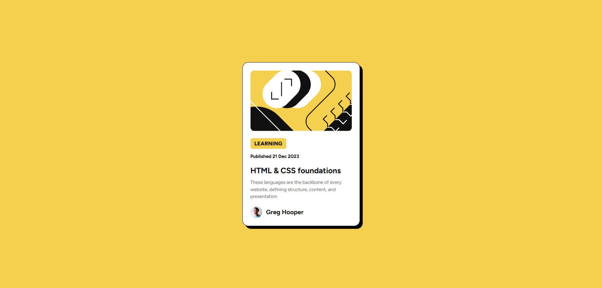

# Frontend Mentor - Blog preview card solution

This is a solution to the [Blog preview card challenge on Frontend Mentor](https://www.frontendmentor.io/challenges/blog-preview-card-ckPaj01IcS). Frontend Mentor challenges help you improve your coding skills by building realistic projects. 

## Overview

This challenge is to reproduce the UI design below: 

### Screenshot

My version: 

### Links

- Solution URL: https://github.com/lzhong0119/Frontend-Mentor_Blog-Preview-Card
- Live Site URL: https://lzhong0119.github.io/Frontend-Mentor_Blog-Preview-Card/

### Built with

- Semantic HTML5 markup
- CSS custom properties
- Flexbox
- Mobile-first workflow